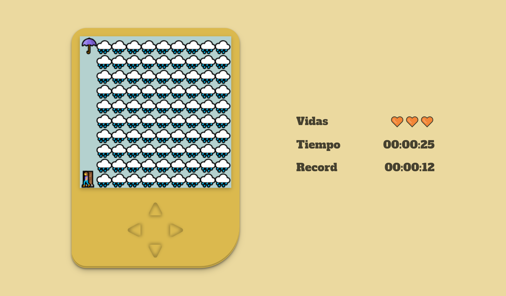

# taller-practico-js-videojuegos

<h1 align="center">
Trueno 🌩
</h1>

Trueno es un emocionante juego de acción y aventuras donde tu habilidad y reflejos serán puestos a prueba. Ayuda a nuestro protagonista a llegar a un lugar seguro para protegerse de una tormenta implacable, mientras esquivas peligrosos truenos que amenazan con interrumpir su camino.

    

<h2> 🌧️ Descripción </h2>
En este juego, el objetivo principal es guiar a nuestro personaje a través de diferentes niveles llenos de retos y obstáculos. ¡Prepárate para esquivar y mantener a salvo a nuestro valiente personaje!

<h2> ⚠️ Características del Juego </h2>
<ul>
    <li><strong>Controles Intuitivos:</strong> Maneja el juego de manera fácil e intuitiva.</li>
    <li><strong>Guarda tu Récord:</strong> Tus mejores puntuaciones se guardan para que puedas ver tu progreso.</li>
    <li><strong>Temporizador:</strong> Cuenta con un temporizador para que calcules cuánto tiempo te estás tardando.</li>
    <li><strong>Vidas Visibles:</strong> Te permite ver cuántas vidas tienes a lo largo del juego.</li>
</ul>
<h2> 📋 Instrucciones </h2>
<ul>
    <li><strong>Moverse a la Derecha:</strong> Usa la tecla "D", la flecha derecha o haz click en el botón derecho del juego. </li>
    <li><strong>Moverse Arriba:</strong> Usa la tecla "W", la flecha arriba o haz click en el botón superior del juego.</li>
    <li><strong>Moverse a la Izquierda:</strong> Usa la tecla "A", la flecha izquierda o haz click en el botón izquierdo del juego.</li>
    <li><strong>Moverse Abajo:</strong> Usa la tecla "S", la flecha abajo o haz click en el botón inferior del juego.</li>

</ul>

Gracias por visitar mi repositorio. ¡Espero que disfrutes del juego! ⭐✨

